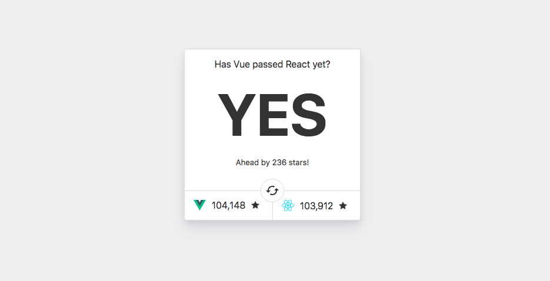

# Has Vue passed React yet?

> Just a fun little site to compare GitHub stars of Vue and React



### Getting Started

To run this locally, clone the repo and use Yarn or NPM to install the dependencies. (You’ll also need Node.js installed)

```bash
git clone https://github.com/stursby/hasvuepassedreactyet.git
cd hasvuepassedreactyet
yarn
```

### Development

Start a dev server on [http://localhost:8080](http://localhost:8080)

```bash
yarn dev
```

### Production

To build for prod, run the following:

```bash
yarn build
```
